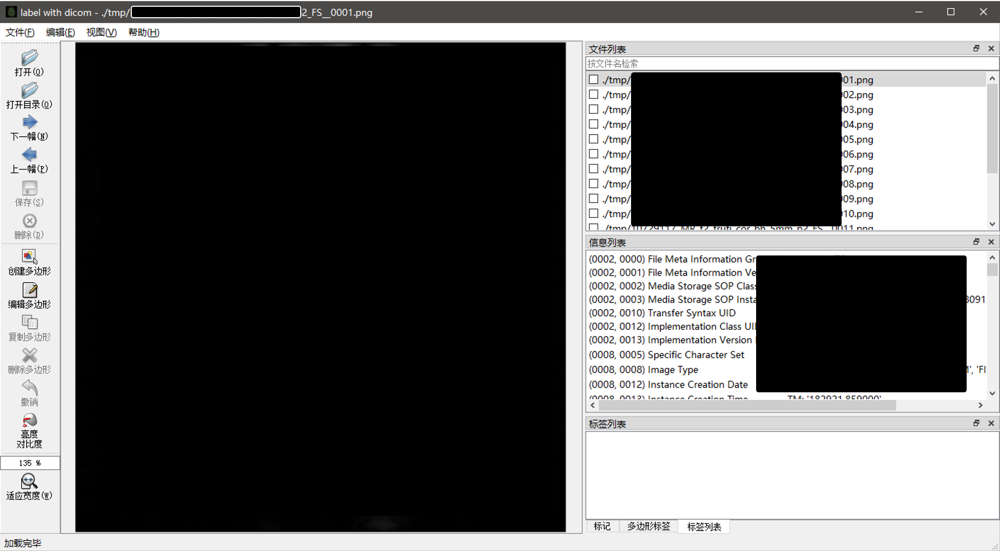

# A label tool for dicom and ima files

这个代码是在[labelme](https://github.com/wkentaro/labelme)的基础上进行修改，用来标注医学图像数据

1. 可以实现Dicom和Ima文件的读入和标注
2. 保存的文件为npy和json，前者包含原始Dicom文件中的pixel_array，后者包含标注信息
3. 可以读取并显示当前dicom文件中的全部信息

